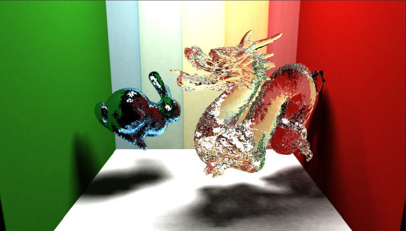

How to make an attractive GitHub repo
=====================================

A guide for [CIS 565](http://www.seas.upenn.edu/~cis565/) students

A good README.md
----------------

Presenting your work well is at least as important as the quailty of the work itself.  The web is full of information and visitors will quickly move on if you do not grab their attention immediately.

Do not keep the original `README.md` with our project instructions.  Instead, completely rewrite it so introduces your project to a technical hiring manager or developer.  Remember, things that are obvious to you might not be obvious to them so provide enough background and context.

### Representitive Image

The `README.md` should start with a title, followed by your name (with a link to your website, twitter, blog, etc.), and then a representitive image of your work.  Including an image like this has been tradition in SIGGRAPH and many other graphics venues for years.  Here's some good examples:

   * [GPU-Accelerated Dynamic Fracture in the Browser](https://github.com/kainino0x/cis565final) by Jiatong He and Kai Ninomiya
   * [Surface Mesh Reconstruction from RGBD Images](https://github.com/cboots/RGBD-to-Mesh) by Collin Boots and Dalton Banks
   * [Accelerated Stochastic Progressive Photon Mapping on the GPU](https://github.com/ishaan13/PhotonMapper) by Ishaan Singh, Yingting Xiao, and Xiaoyan Zhu
   
Here's the photon mapping image:

The image should be representitive in that it highlights the breadth and depth of your work.  It should be your favorite showpiece.  Make sure the resolution is reasonable so it downloads quickly.

### Highlight features with screenshots

Show.  Don't tell.

Use screenshots with captions to build up the features in your project.  For example, see:

* [Interactive Real-Time WebGL Fluid](https://github.com/dblsai/WebGL-Fluid) by Binglu Du and Xingjie Ma

Each feature is highlighted with a screenshot (animated gifs actually work quite well for this project).  Scroll down more to the `Water Simulation` section where they introduce the components of the fluid simulation starting with just the height map and then building up to object interaction with the surface.

The representitive image for [Surface Mesh Reconstruction from RGBD Images](https://github.com/cboots/RGBD-to-Mesh) also nicely builds up its features:

### Annotate

In additional to screenshots that break down each feature, it is illustrative to annoate a representitive image, perhaps even _the_ representitive image point out each feature like Kai Ninomiya did in his [GPU path tracer](https://github.com/kainino0x/Project3-Pathtracer):

I know the caustics and Fresnel are obvious to you, but they are not obvious to everyone.

### TODO: comparision

### TODO: debug views

### TODO: bloopers

### TODO: videos and demos, link back.

### TODO: performance anaylsis

More tips
---------

* Feel free to rename your fork of the starter-code repo.  For example, just because we named a repo `Project6-DeferredShader`, doesn't mean you have to.  Likewise, feel free to edit the description at the top of the repo page.
* Don't clutter the root directy with too many files because it will force visitors to have to scroll a lot to get to your `README.md`.
